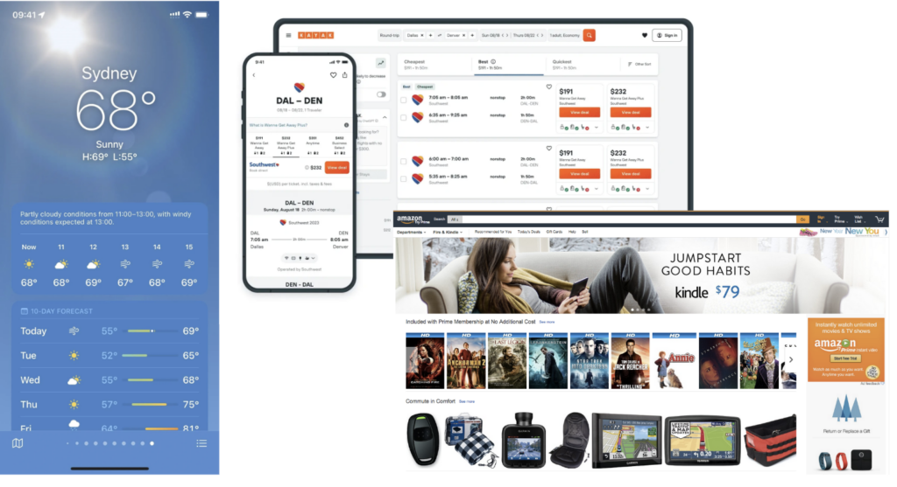
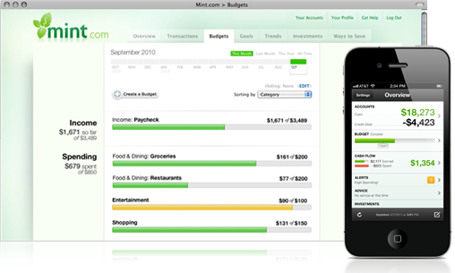
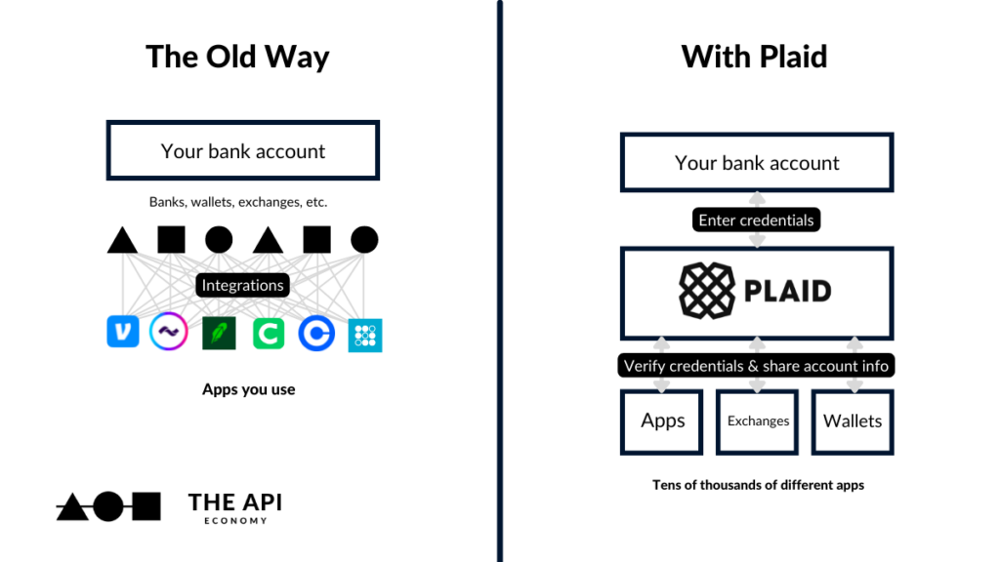
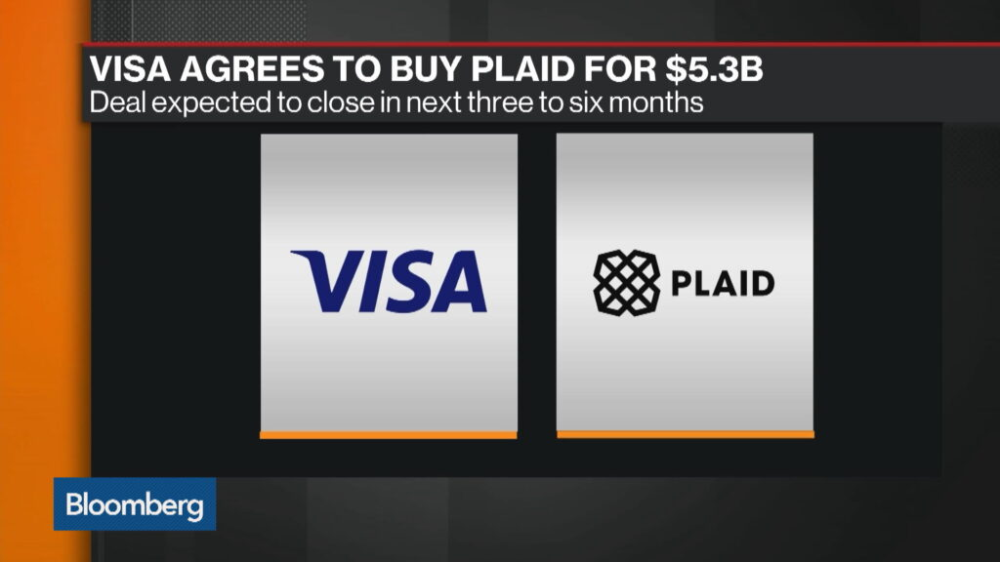

APIs aren’t just plumbing for developers — they’re becoming the foundation of a new financial ecosystem. From checking your balance in a budgeting app to sending money across borders, APIs now power the everyday experiences users expect from fintech.

At the center of this shift? **Open Banking** — the movement pushing financial institutions to unlock data and services through secure APIs. And **Plaid** — the quiet giant building the connective layer between banks, apps, and the future of money.

Let’s break down how we got here, what PSD2 kicked off, and why this new API-first economy is reshaping everything from payment rails to product strategy.

* * *

### **APIs: The Plumbing of Modern Products**

At their core, **APIs (Application Programming Interfaces)** are how software systems talk to each other. But that’s just the surface.

They’re how:

- Your weather app pulls forecasts from AccuWeather ☁️  
    

- Kayak grabs flight data from hundreds of airlines ✈️  
    

- Amazon.com stitches together 1,000+ microservices to feel like one seamless experience 🛒

In today’s product world, APIs are the glue. They turn rigid monoliths into flexible ecosystems. And in fintech — an industry known for being slow-moving and risk-averse — APIs are unlocking a more open, collaborative, and user-centric future.

* * *

### **Let’s Talk PSD2: Open Banking Goes Mainstream**

In Europe, regulators aren’t just nudging banks toward innovation — they’re mandating it.

**The PSD2 directive (Revised Payment Services Directive)** introduced two big ideas:

- **Strong Customer Authentication (SCA)**

- **Open Banking via standardized APIs**

Translation: Banks are now _required_ to expose key data and payment capabilities through secure APIs — enabling third-party apps (with user consent) to build better, smarter experiences.

**Real-world impact?**

- **Mint.com** pulls in data from multiple financial institutions, giving users a single view of their money.  
    

- **Trustly** lets users pay businesses directly from their bank accounts, bypassing credit card networks and saving everyone time and fees.

PSD2 isn't just about compliance — it's about competition. And the winners are consumers, who now get more choice, better UX, and fewer hoops to jump through.

* * *

### **Plaid: The API Layer That Connects It All**

While apps like Mint and Trustly solve specific use cases, **Plaid** plays a different role. It’s the infrastructure layer beneath them — connecting financial institutions to developers via a single, trusted interface.

Plaid does two big things really well:

1. **It built the ecosystem**With over 9,600 connected banks and fintechs, Plaid’s relationships form the backbone of modern financial connectivity.  
    

3. **It simplifies the chaos**Every bank has different APIs. Different formats. Different security policies. Plaid standardizes all that complexity into a clean, secure, developer-friendly API — so product teams can focus on building, not untangling spaghetti.  
    

For fintech builders, this means less friction and faster launches. For users, it means their favorite apps “just work.” And for Visa? It meant a strategic imperative.

* * *

### **So Why Did Visa Want Plaid So Badly?**

Because **Plaid represents the future of financial infrastructure**, and Visa knows the payment rails are evolving fast.

Visa built its empire on credit card networks — trust-based, secure, and universal. Plaid offers a new layer of trust: one built not on plastic cards, but on **secure API access to financial data**.

By trying to acquire Plaid, Visa wasn’t just buying a product — it was hedging against disintermediation and staying relevant in an API-first world.

The deal eventually fell through due to regulatory pressure, but the signal was clear: **Fintech infrastructure is a strategic battleground.**

* * *

### **The Big Picture: Trust, APIs, and the New Fintech Stack**

Whether it’s PSD2 driving regulatory change or Plaid enabling developer agility, one theme connects it all: **trust-based partnerships, powered by secure APIs**.

We’re moving from a world of siloed financial institutions to one of interoperable platforms. From closed systems to open ecosystems. And APIs are what make that shift possible.

* * *

**Wrap-up:**

The API-first economy isn’t a trend — it’s the new foundation for how financial products are built, integrated, and scaled.

So next time you connect a budgeting app to your bank, or pay for something with your account directly, remember: you’re not just using a product — you’re riding the rails of a more connected, collaborative economy.
