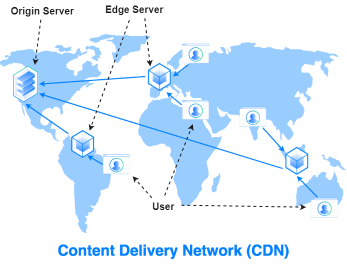

We live in a world where your website _is_ your storefront. Your conversion funnel. Your brand. Your everything. Whether you’re running a content empire, selling a niche product, or building the next viral app — how your site performs, scales, and stays online isn’t just technical ops. It’s business survival. That’s why, at a certain point in every online business’s growth, someone drops the magic acronym: **CDN**.

But what exactly is a CDN (Content Delivery Network)? And why does it matter if your traffic is spiking, your audience is global, or your servers are sweating? Let’s break it down — with some help from Diet Coke and the Champions League.

**First, let’s talk pain. Here’s what scaling websites struggle with:**

🎯 **Performance**Speed isn’t a luxury. It’s a lifeline. According to Google, 53% of mobile users will bounce if your site takes more than 3 seconds to load. Even a 1-second delay can tank conversions by 7%. If your content is picking up steam and your audience is global, slow page loads from far-off users = lost revenue, full stop.

🚨 **Reliability**Traffic spikes are a double-edged sword. That viral review or product drop? It might bring in thousands of new users… and take your server down with it. One crash, and your hard-won visitors might never come back.

🛡️ **Security**With scale comes attention — not all of it good. Bots, scrapers, DDoS attacks, and bad actors love high-traffic sites. And security lapses often get noticed only _after_ the damage is done.

**Enter the CDN: Your Global Sidekick for Scale**

So what _is_ a CDN? Think of it as a network of servers strategically placed around the world that deliver your website content from the closest possible location to each user. Instead of every visitor hitting your origin server (the one you pay for), they’re served a cached copy from a nearby “Point of Presence” (PoP). Faster, safer, and way more scalable.

Let’s put it in real-world terms...

**Imagine Diet Coke… but only available in Atlanta**

Coca-Cola’s HQ and original bottling plant are in Atlanta. Now imagine that’s the _only_ place you can get a Diet Coke. You live in Boston? You’re making a 1,000-mile road trip every time you want a fizzy fix.

Here’s what happens next:

- **Performance:** Long drive, long lines. Everyone’s showing up at once. It’s chaos.
  
- **Reliability:** Atlanta’s overwhelmed. Machines break. Doors close. No Diet Coke for you.
  
- **Security:** Crowds attract bad actors — bootleggers, pickpockets, fake tickets. It’s a mess.

Now back to reality: Diet Coke is _everywhere_. Grocery stores, vending machines, airports. That’s possible because Coca-Cola built a massive global distribution network to deliver Diet Coke where you need it, when you want it. That’s exactly what a CDN does for your content.

**Now swap Diet Coke with… the Champions League Final**

Let’s say Goal.com drops a match recap after Real Madrid clinches another Champions League title. Traffic explodes. Fans are tuning in from Madrid, Mumbai, Miami, and Melbourne.

Without a CDN: every single request has to go back to Goal.com’s origin servers in London or New York. That’s a ton of digital miles — slow, expensive, and risky.

With a CDN: that article is cached on servers _around the world_. The Mumbai fan gets the recap from a local PoP. It’s fast, seamless, and everyone’s happy (unless you were rooting for the other team).

* * *

**Bottom line: CDNs are like global vending machines for your website.**

They:

- Serve content closer to your users → faster load times  
    

- Offload traffic from your origin server → fewer crashes  
    

- Act as a security buffer → less exposure to threats

* * *

Providers like Akamai, Cloudflare, and Fastly operate tens of thousands of servers globally. You don’t need to go enterprise to benefit — even small sites can plug in and scale with confidence.

**Wrap-up:**If your website is starting to feel like it’s outgrowing its hosting plan, or your users are starting to grumble about performance — it might be time to CDN-up.

Think of it as moving from a homemade lemonade stand to a global soda distribution network. Same product. Way more scale.
