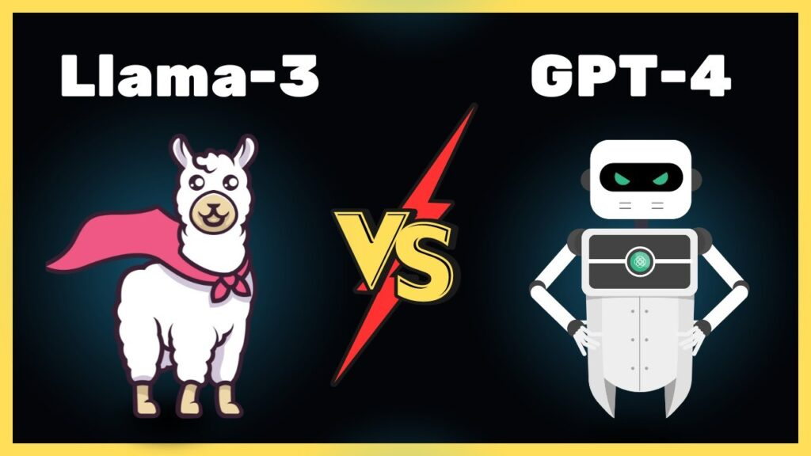

It started as a weekend experiment: I wanted to ask questions about the hundreds of recipes my wife and I have collected over the years - things buried in old Google Docs, random screenshots, and PDFs from food blogs that no longer exist. Instead of searching or scrolling, I wanted to just _ask_ - “What can I make with leftover chicken thighs?” or “Which curry recipe used coconut milk and tamarind?”

So I built a small RAG-powered assistant to turn all those scattered notes into a searchable, conversational archive. It worked surprisingly well, and taught me a few things about building AI products by vibe before structure.

## **⚙️ My Stack (or: How the Stack Chose Itself)**

Like most side projects, this one doubled as a tech sandbox. I used **Cloud Code** for quick prototyping, experimented with **Supabase** for storage and auth, **LangChain** for retrieval, and **MongoDB** for structured metadata - all deployed on **Vercel** for fast iteration.

I also evaluated with **OpenAI’s APIs** and **open-source Llama models**, exploring the trade-offs between ease, cost, and control - a decision every AI builder eventually faces. My goal wasn’t to ship something production-ready, but to see how each layer behaved once the data stopped being clean and the questions got weird.

## **1\. You Can “Vibe Code” Your Way Into a Full Stack Project**

What blew me away wasn’t that the assistant worked — it’s that I could _build it at all_.

I haven’t written production code in years, but in one weekend I was wiring together APIs, databases, and embeddings that would’ve taken months of engineering not too long ago. Between open-source frameworks, cloud-native tools, and access to quick answers, the bar to _ship something complex_ has dropped through the floor.

You don’t need to remember every syntax rule — you just need product intuition and a willingness to tinker. We’re entering a wild new era where **creativity scales faster than code fluency**. The bottleneck isn’t engineering capacity anymore — it’s imagination.

## **2\. Your Data Is the Product**

The biggest friction in building my recipe assistant wasn’t the model - it was the data.

All those Google Docs I’d collected over the years were a nightmare for retrieval: inconsistent titles, no tags, half the files screenshots of old emails. There was zero structure, and that made the RAG pipeline stumble. You can’t retrieve context that doesn’t exist.

It was a good reminder that **data hygiene is now product design**. In the AI era, your model is only as smart as the metadata you feed it. We’ve spent a decade obsessing over UX for humans; now we have to design UX for machines - shaping how they _find_ and _understand_ what we’ve built.

## **3\. The Real Bottleneck Might Be Your Credit Card**

At some point, I got ambitious and tried to roll my own RAG pipeline - homegrown embeddings, self-hosted vector storage, and an **OpenLlama** model for inference. It worked… sort of.

After a few days of debugging and GPU burns, I gave in and switched to **OpenAI APIs** for the NLP and retrieval layers. It solved the quality problem instantly, BUT created a new one: **cost**.

Even small-scale projects can rack up bills fast when you’re embedding, chunking, and querying constantly. The bigger lesson? You can’t brute-force your way to scalability with hosted models.In the coming years, the real art of AI product design will be **balancing quality, control, and cost** - deciding when “good enough” is actually good enough.

## **4\. Security Isn’t Old News. It’s the Next Frontier**

Even small AI experiments expose big security gaps.

Every now and then, I’d hit a wall where the easiest way to move forward was to just share an **API key or OAuth token** with broader permissions than I’d ever allow in production. It worked - but it didn’t feel right. So I started setting up **service accounts** and tighter scopes. But here’s the thing: most people building quick AI prototypes won’t do that.

As the barrier to build drops, **the surface area for risk explodes**. The same primitives that governed old-school infrastructure - auth, roles, audit trails - now matter just as much in this AI-native world.AI’s next growth bottleneck won’t be GPUs or context windows - it’ll be **governance**.

## **5\. The Next Exploit Vector Might Be… Us**

I can read code and understand it, but I’m no expert in exploit detection. While using **Cloud Code** and other copilots, I caught myself doing what millions of builders are doing - pressing **Enter** on AI-generated code without much thought.

We already know debugging AI-generated code is a nightmare - but the larger challenge isn’t just fixing errors, it’s _trusting_ what works. When code is probabilistic, even “green checks” can hide silent failures waiting to surface later.

The convenience is intoxicating. You’re in flow, it works, and nothing breaks - so you move on. But behind the scenes, that’s a recipe for quietly introducing vulnerabilities at scale. The next big security wave won’t come from stolen credentials - it’ll come from **blind trust in autocomplete**.There’s a huge opportunity here for anyone building **AI code observability and verification tools** - something that keeps the “magic” of copilots but adds a layer of trust.

## **6\. Ecosystems Are the New Gatekeepers**

While building, I noticed something subtle but powerful: **the stack chose itself**.

Tools like **Claude Code** and **Lovable** didn’t just help me code - they _recommended_ what database, model host, or deployment platform to use. And without thinking twice, I went with their suggestions. I didn’t Google alternatives. I didn’t weigh trade-offs. I just… clicked. That wasn’t coincidence or sponsorship. It was **ecosystem gravity**.

These tools optimize for flow - for helping builders get from zero to “it works” as fast as possible. So they naturally surface tools that are reliable, well-documented, and developer-friendly: platforms like **Supabase**, **Vercel**, **Render,** and **LangChain** that make integration feel frictionless.

Sure, there are partnerships and co-marketing efforts behind the scenes, but what really drives adoption is **DX alignment** - tools that “snap together” cleanly. The ecosystem defaults that remove decision fatigue end up becoming the distribution channels of the AI era.The next generation of “GenAI giants” won’t just own models. They’ll own **the defaults** - the tools that quietly become the _recommended path_ inside the builders’ workflow.

## **7\. The “Single Pane of Glass” Dream Just Got Real**

Every tool I used - from Supabase to Cloud Code - came with its own dashboard, logs, and knobs to tweak. After a few hours, I had five browser tabs, three terminal sessions, and one growing sense of déjà vu.

The age-old dream of a **single pane of glass** suddenly feels urgent again. As AI workflows sprawl across models, vector stores, and orchestration layers, the team that can bring that visibility together wins.

Whoever builds the “control center” for AI projects - where you can see cost, context, quality, and security in one view - will define the next generation of developer platforms.

## **Closing: The Next PLG Motion Will Be Secure AI Toolchains**

If there’s one big takeaway from this little side project, it’s that we’re entering the **toolchain era of AI**.

Everyone’s building with the same core ingredients - models, storage, orchestration - but the real leverage comes from **how easily & securely those parts snap together**. The next breakout platforms won’t just build better models; they’ll build better _connections_ between them.

Just like cloud made infrastructure self-serve, AI will make _intelligence_ self-serve - but only if the underlying tools feel cohesive, governed, and cost-aware. The companies that get that balance right won’t just power builders like me - they’ll define what “product-led” means in the age of AI.
