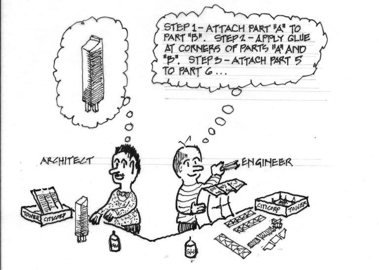
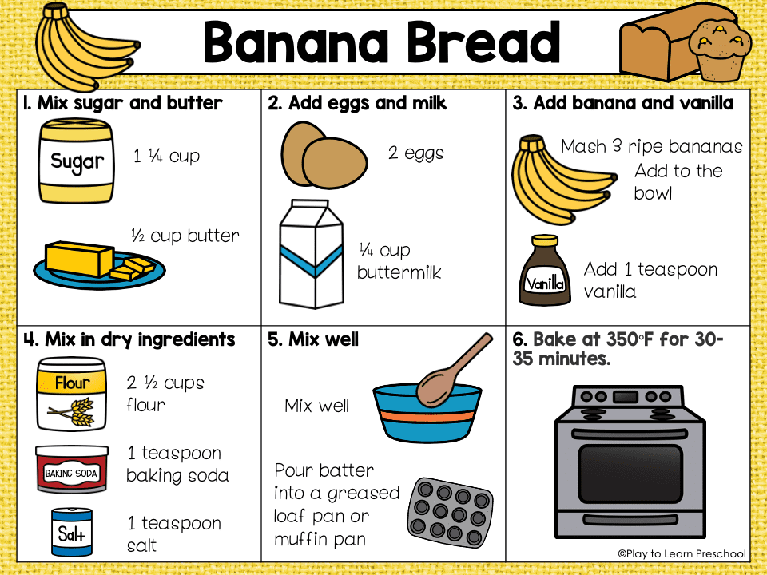
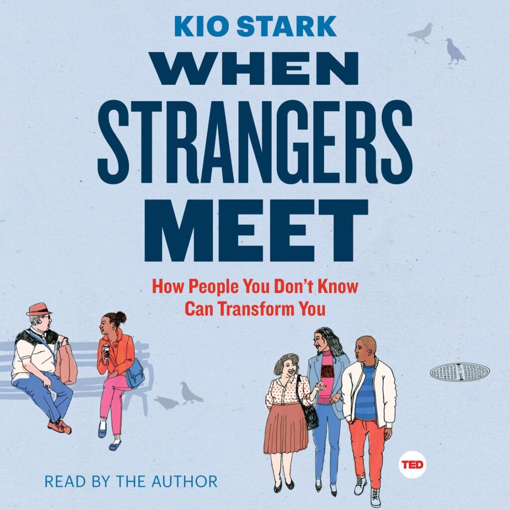
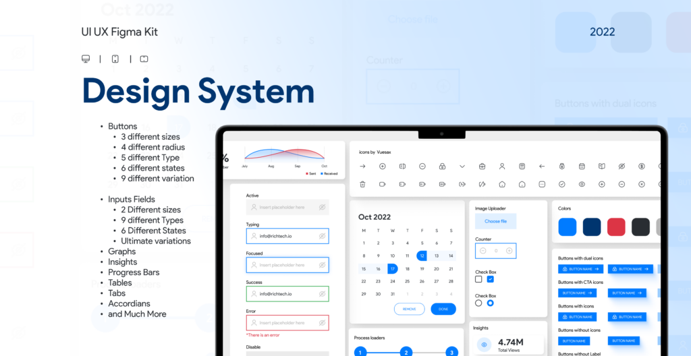

If you’ve read my past posts on [**developer experiences**](https://productledjourney.com/2019/01/05/developer-experience/) and [**APIs**](https://productledjourney.com/2020/03/01/api-first-economy/), you know I’m bullish on developer experience (DX) and APIs. But building an API-first product isn’t just about writing endpoints and calling it a day. When you're positioning your product as a **Platform-as-a-Service (PaaS)** — something meant to plug into larger ecosystems — the rules of product management don’t disappear. They just get more... invisible.

APIs may not have a shiny UI, but everything still matters: onboarding, documentation, value props, user flows, business cases, prioritization. It's all in play — just abstracted one layer deeper.

Here are **11 hard-earned lessons** for PMs building API-centric platforms.

### 1\. Know Your Audience: The "Why" vs. the "What"

Platform products attract both technical and non-technical stakeholders — and they care about _very_ different things.

- CTOs, architects, internal execs want to know **why** your API matters.  
    

- Developers, sales engineers, and solutions teams want to know **what** it can do.

📣 Tip: Tailor your pitch. Use reference architectures and ROI to win over execs. Use demo-ready endpoints and docs to win over builders.

* * *

### 2\. Be the Translator: Connect Value to Usage

> 
> 
> “Words travel worlds. Translators do the driving.”
> 
> That’s your job.

An API might do something magical — but if it’s buried under jargon or requires 5 mental hops to understand its impact, no one will care.

📣 Tip: Frame endpoints in business outcomes for non-devs. Use real-world tasks for devs. Always bridge the gap.

* * *

### 3\. Set Success Metrics (Global vs. Local)

APIs are detailed by nature — so are the metrics that track them. The trick? Don’t drown in the data.

- **Global Metrics** = business impact  
    e.g. active API tokens, new API key creations

- **Local Metrics** = system health  
    e.g. uptime, latency, 4xx/5xx error rates, compute time

📣 Tip: Use both. Global shows impact. Local shows performance.

* * *

### 4\. Make One API Call Feel Effortless

The gold standard: zero-effort onboarding.

- Use **API keys, OAuth, or JWTs** (with the right trade-offs)

- Design endpoints around **real use cases**

- Aim for one endpoint = one job

📣 Tip: If a developer can’t get a successful call in under 5 minutes, you're leaking adoption.

* * *

### 5\. Treat Docs Like Your UI (Because They Are)

Your docs are your homepage.

Your UX.

Your first impression.

📣 Must-haves:

- Use-case-driven examples

- Changelogs for every update

- Common error responses and debug tips

- Scenario-based guides (not just endpoint references)

- A testable, GitHub-friendly doc setup that invites contributions

🛠 Pro Tip: Docs are never done. Treat them like code. Ship improvements weekly.

* * *

### 6\. Build the World Around the API

Your API is the core — but integrations and SDKs are the accelerators.

There are two kinds of integrations to focus on:

- **Standardization integrations**: Tools like Terraform, Ansible, etc. Simplify ops and make your API stack-friendly.

- **Value-add integrations**: Plug into complementary ecosystems (think Kubernetes, observability, commerce tools) to unlock new workflows and monetization.

📣 Tip: Partner-driven integrations often lead to your best revenue flywheels.

* * *

### 7\. Your Best Use Case Might Come from a Stranger

APIs are Legos. Your job is to make them snap together easily — and watch what people build.

📣 Tip: Encourage wild experimentation. Support your community on GitHub, Stack Overflow, Discord. Sponsor a hackathon. Someone might build your next feature for you.

* * *

### 8\. API Versioning Will Haunt You (Unless You Do This)

Unlike UI updates, APIs don’t have a central place to update. They're embedded in scripts, CI/CD pipelines, third-party systems…

📣 Survive with:

- **Additive over breaking** changes

- **Semantic versioning (SemVer)** — use it, communicate it, respect it

- A clear deprecation policy (with timelines and tooling)

Trust me: your future self (and your users) will thank you.

* * *

### 9\. Don’t Be a Black Box

APIs without observability are trust killers. You need the holy trinity:

- **Metrics** — availability, latency, throughput

- **Logs** — clear, actionable error messages

- **Traces** — end-to-end request visibility

📣 Tip: Expose these externally where appropriate. Make debugging easy — it builds loyalty.

* * *

### 10\. Scale the Story, Not Just the Stack

When it’s time to launch, zoom out. Get GTM teams excited. Arm sales and marketing with the “why it matters” story.

📣 Tip: Train your technical marketers and solutions engineers to highlight outcomes, not just specs. Developer-facing =/= developer-only.

* * *

### 11\. Don’t Rule Out a UI

Even if your audience is dev-heavy, a GUI can:

- Lower the barrier for non-technical stakeholders

- Help with discovery, demos, internal advocacy

- Improve usability for quick tasks (even for devs!)

📣 Tip: A light dashboard, workflow builder, or visualizer can be a force multiplier — without diluting your API-first strategy.

* * *

**Wrap-up:**

API-first platforms are eating software. But building one isn’t just about code — it’s about **clarity**, **community**, and **craft**.

Focus on _how_ your API gets used — not just what it does — and you’ll unlock more adoption, more love, and more leverage.
