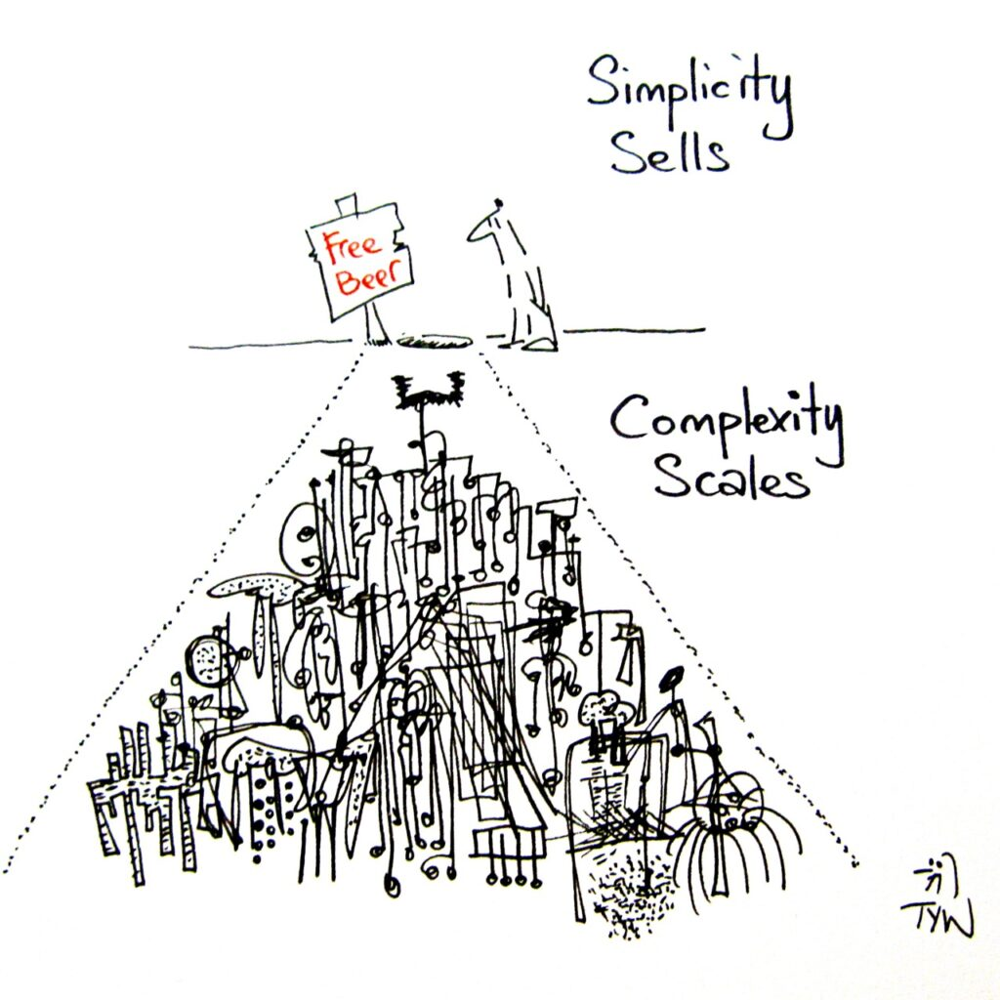
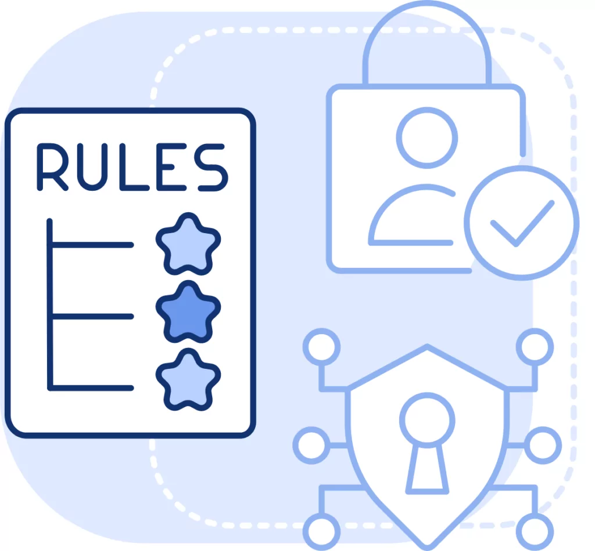
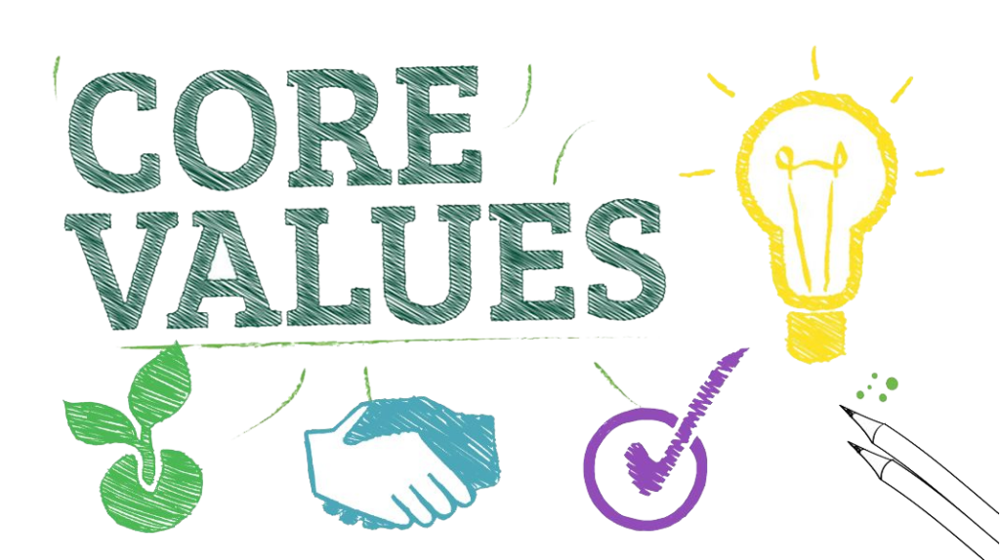

Everyone loves to talk about PLG like it’s magic:  
✨ Build a great product → Users show up → Revenue explodes ✨

But let’s be real — Product-Led Growth isn’t just about having a “clean UX” or free trial. It’s a discipline. A mindset. A _team sport_.

If you want your product to drive acquisition, expansion, and retention without relying entirely on sales and marketing, you’ve got to be intentional. Here are 8 principles I’ve seen behind _sustainable_ PLG motion — not the hype, the real stuff.

### 1\. Make Product Usage the Front Door (Not a Side Door)

Let people get started in seconds. Not after a sales call. Not with a contract. Not even with a credit card if you can help it.

Great PLG products lower the barrier to value:

- Self-serve signup

- Guided onboarding

- Fast paths to the “aha moment”

If users don’t feel momentum in the first few minutes, you’ve already lost them.

### 2\. Incentivize Value Over Vanity

Usage is good. Value is better.

High-performing PLG companies don’t just track usage — they build feedback loops that reward _useful_ product engagement:

- Tie feature success to **PQLs**, not just MQLs

- Incentivize sales on expansion & stickiness, not just new logos

- Price and package features based on actual customer outcomes

📉 Otherwise? You’ll end up with a bloated roadmap, poor retention, and an expansion funnel that never converts.

### 3\. Design for Openness by Default

In a PLG model, your product _is_ your distribution channel.

That means frictionless collaboration isn’t a nice-to-have — it’s core to growth.

The best PLG products don’t hide sharing, permissions, or workflows behind enterprise paywalls or support tickets. They build collaboration into the default experience:

- Shareable links (with fine-grained access)

- Real-time editing or commenting

- Seamless handoffs between teams and roles

- Transparent activity logs

Think of how Figma, Notion, or Loom exploded — not just because they were useful, but because they were _easy to share_. Collaboration was baked into their atomic unit of value.

📣 Tip: If your product works well for a single user, that’s good. But if it spreads _because_ it works better with others — that’s PLG gold.

### 4\. Simplicity ≠ Simplistic

Users crave simple experiences. But under the hood? Your tech can (and should) be sophisticated.

Take Datadog: powerful telemetry, clean UI. That balance only comes from _maniacal_ focus on UX, fast iteration, and obsessive customer listening.

🎯 The goal: hide the complexity, not the capability.

### 5\. Don’t Ignore the Admins

PLG often focuses on the individual user — but organizations scale through **admins**.

  

Admins care about:

- Standardization
- Permissions & roles
- Data governance
- Onboarding & offboarding at scale
  

  

The best PLG companies build for them too:

- APIs for automation

- Template-based configs

- Governance-friendly defaults

Make life easier for admins, and they’ll become your biggest internal champions.

* * *

### 6\. Security ≠ Secrecy

“Security by obscurity” — where features are protected by just not talking about them — is not a strategy. It’s a liability.

In a PLG world, collaboration and transparency are key to growth. Your product should be secure _and_ usable:

- Granular access controls

- Transparent permissions

- Clear logs and audit trails

Good security **enables** collaboration. It doesn’t block it.

* * *

### 7\. Use Your Own Product. Religiously.

Every PLG leader I know dogfoods their product — not just before launch, but every day.

Why it matters:

- You catch the friction before your users do

- You build empathy fast

- You unblock product velocity with fewer assumptions

Want better feedback loops? Start with your own team.

* * *

### 8\. Design Your Culture Like You Design Your UX

PLG isn’t just a product strategy — it’s an organizational one.

The best PLG companies operate the way their products behave:

- Collaborative

- Transparent

- Simple and empowering

- Fast but thoughtful

That shows up in everything from design language to customer success handoffs. If your internal culture feels like a clunky enterprise app, your product probably will too.

* * *

**Wrap-up:**

PLG isn’t just free trials and pretty buttons. It’s product strategy meets company DNA — with a relentless focus on delivering value _before_ asking for commitment.

So if you're building a PLG motion, ask yourself:

> Are we designing for how our users _buy_… or how we want to _sell_?

Get that right, and the growth follows.
