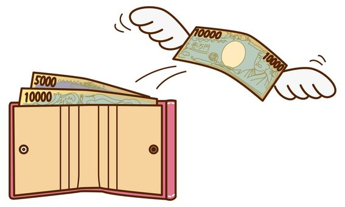
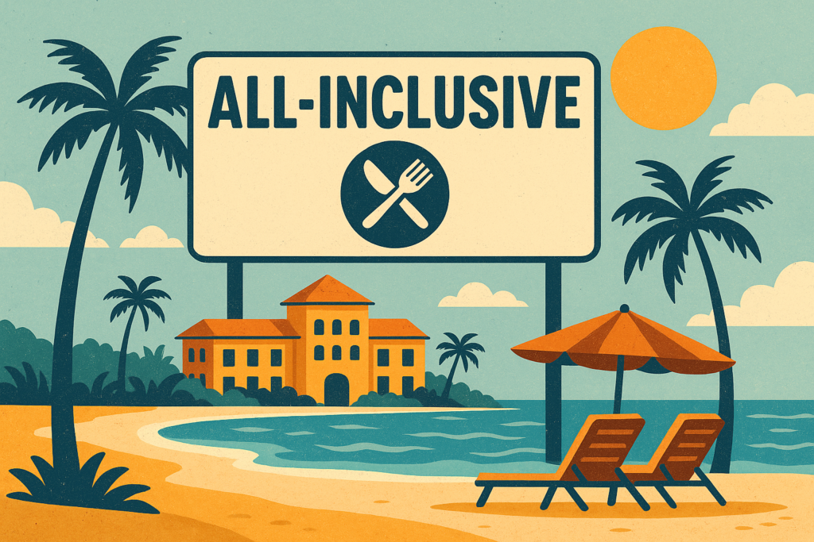

You’ve had a solid Saturday night. Music, drinks, good vibes. You step outside the bar, and there’s a lineup of yellow cabs ready to whisk you home. But instead, like clockwork, you pull out your phone and open Uber. Surge pricing is in full swing — 2x the usual fare. You hesitate for half a second… then tap “Confirm.”

Why do so many of us ignore the cheaper, more immediate option and still choose Uber? The answer isn’t just brand loyalty or convenience. It’s something sneakier, smarter — and very human.

* * *

**The real reason we choose Uber (even when it's more expensive):  
**

Uber doesn’t just get you from point A to B. It removes the psychological sting of payment. No digging through your wallet. No awkward small talk while the meter ticks. You step out of the car and… that’s it. Done. Psychologists call this _removing the pain of paying_. It’s why Uber feels easier, and sometimes even “cheaper,” than it really is. The transaction fades into the background — and our brains love that.

Now here’s where it gets interesting: this same behavioral trick is being used in unexpected places — like cloud storage.

**Behavioral Economics Meets Cloud Storage**

As someone who’s mildly obsessed with behavioral economics (and not-so-mildly obsessed with emerging tech), I’ve started noticing how “pain of paying” strategies are showing up in the storage world — especially with newer, product-led models.

Here are two of my favorites:

* * *

**1\. The Path of Least Resistance: Pay-as-you-go, FTW**

Cloud storage players like AWS and Azure have embraced the classic behavioral concept of default behavior — aka “just make it easy and people won’t switch.”

Their weapon of choice? Auto-billing and usage-based pricing. Instead of a lengthy procurement cycle or big upfront contracts (hello, CapEx), users get to try first, pay later — with charges quietly appearing on the next invoice. Unless something breaks or costs spike, most teams don’t think twice. It just keeps working.

This isn't just convenient. It's sticky. By reducing friction in both adoption _and_ payment, cloud vendors nudge customers toward inertia. You start using it, you get value, and you don’t feel the bite of each transaction. Behavioral economists would call that a nudge. SaaS folks call it brilliant.

> 💡 _“When we pay for things directly, we are painfully aware of the cost. But when the cost is hidden, we don't feel the pain — and we end up spending more.”_
> 
> Dan Ariely, _Predictably Irrational_

**2\. All-Inclusive Bundles: Because “Free” Feels Better Than “Cheap”**

Another pricing trick that taps into behavioral psychology: the all-in-one bundle.

Think of how resorts charge more for “all-inclusive” — and still get better reviews. That same psychology plays out in storage and appliance-based software. Instead of asking customers to add features à la carte (and feel every nickel-and-dime), vendors wrap it all into one price.

Even if the bundle includes features customers don’t need, it _feels_ like a deal. There's no micro-moment of regret each time they enable something new. Just one upfront cost, and everything else feels “free” from there.

And bonus: once users are onboard, vendors get to introduce new features as “included benefits,” subtly nudging adoption and increasing perceived value — all without triggering the pain of a new purchase decision.

**Wrap-up:**Whether you're hailing a ride or scaling your storage, how you pay matters just as much as what you're paying for. Behavioral economics teaches us that removing friction — especially at the point of payment — increases adoption, satisfaction, and willingness to pay.

So next time you're thinking about pricing, ask yourself:

**Are you making your users feel the transaction… or just the value?**
