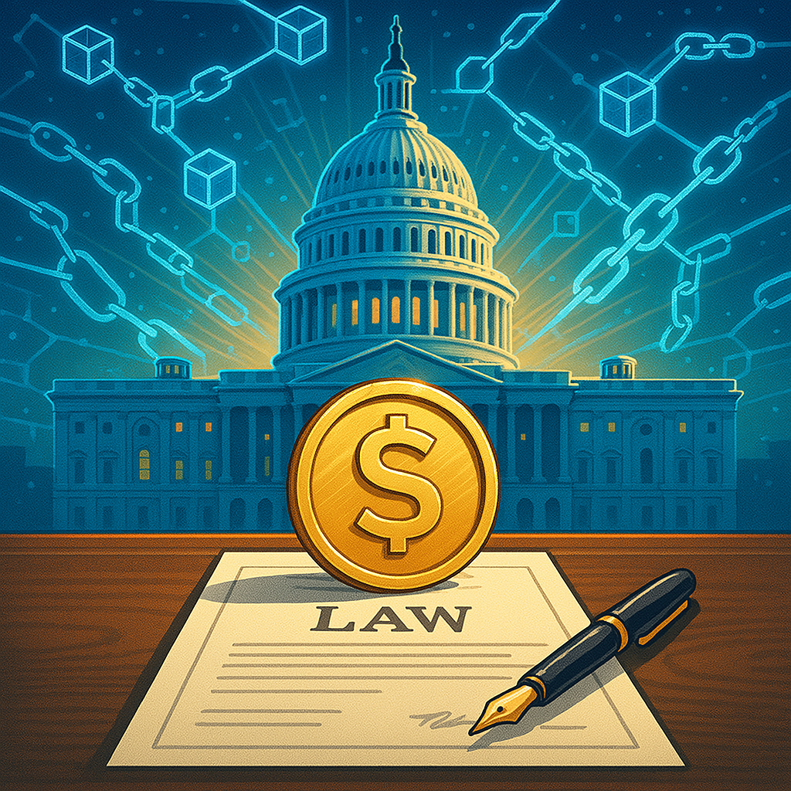
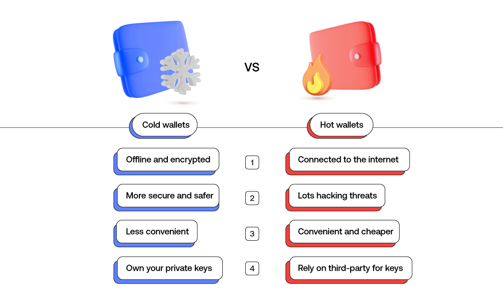
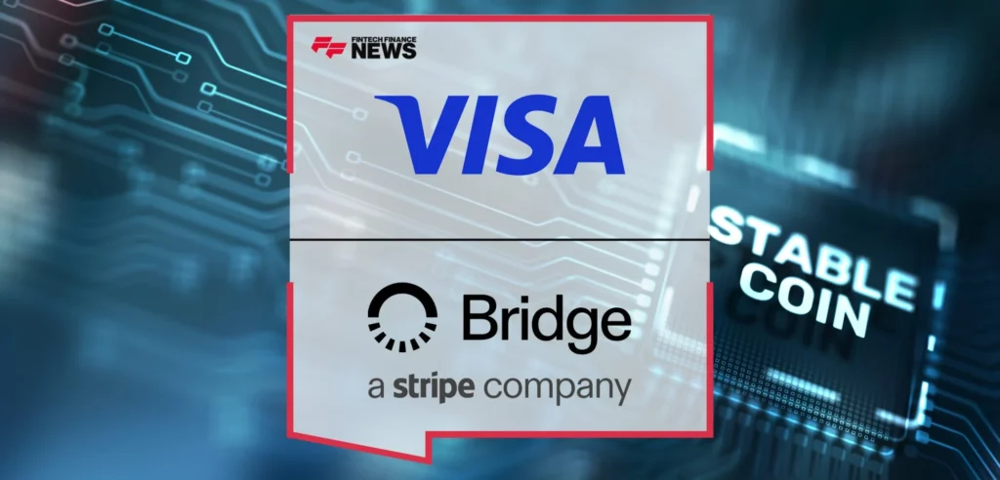

Stablecoins have been in the crypto toolkit for years, but with the **GENIUS Act** now officially passed in the U.S., they’ve taken a major step out of the shadows — and into mainstream finance.

Whether you're deep in Web3 or just crypto-curious, now’s a good time to pause and ask:  
**What** **_actually_** **are stablecoins? Why do they matter? And how does this new regulation change the game?**

Let’s break it down.

### **🧊 First: What’s a Stablecoin, Really?**

At a basic level, a **stablecoin** is a digital token that’s **pegged 1:1 to the U.S. dollar**. One stablecoin = one dollar. Simple.

Behind the scenes, here’s what’s happening:

- A company (like Circle, Tether, or PayPal) **takes in your $1**,  
    

- Issues **1 stablecoin** in return,  
    

- Then **invests that $1 in U.S. treasuries or cash equivalents** to earn interest.  
    

So yes — that token might be chilling in your crypto wallet, but the dollars backing it are likely earning yield just like your bank deposits.

And just like banks, these issuers generate revenue from the **interest income** on those underlying reserves.

### **🛡️ Regulated Stablecoins = Qualified Custody**

Not all stablecoins are created equal. The big shift happening now — especially post-GENIUS Act — is around **regulation and custody**.

**Qualified custody** means the dollars backing your stablecoin aren’t sitting in some random checking account. They’re:

- Held by **regulated financial institutions** (think banks or trust companies),  
    

- Segregated from the issuer’s operating funds, and  
    

- Auditable and redeemable at any time.

But it’s not just the dollars that are protected — it’s the **digital keys** too.

Qualified custodians use a mix of **offline cold storage** (ultra-secure, physically isolated vaults for long-term storage) and **online hot wallets** (for real-time liquidity and redemptions).

These setups are designed to:

- Prevent hacks or unauthorized access  
    

- Support real-time usage and settlement  
    

- Meet institutional-grade compliance standards  
    

It’s the financial and technical backbone that gives regulated stablecoins their credibility — and opens the door for institutional adoption.

* * *

### **🌍 Real Use Cases: From Argentina to Airbnb**

So who actually uses stablecoins — and why?

Turns out, **millions of people globally** rely on them daily. Some of the most powerful use cases live outside the U.S.:

- **Hedging against inflation** — In countries like Argentina or Venezuela, stablecoins are used as a digital dollar savings account. When local currency loses value by the week, a USD-pegged token becomes a lifeline.  
      
    In fact much of Latin America, travelers **don’t even bother exchanging money** when heading abroad. They just use crypto wallets to spend directly in stablecoins. Cheaper, faster, more flexible.

- **Cross-border remittances** — Sending money via stablecoins is faster, cheaper, and doesn’t require middlemen or expensive transfer fees. I.e. send money across borders in seconds, without the Western Union fees

- **Merchant payments with yield** — Stablecoins can create new margin opportunities for merchants. By settling pay-ins and pay-outs in stablecoins, they can **earn interest on float** held in wallets or treasuries — something traditional payment systems rarely offer.  
    

- Trading - Stablecoins are the base currency of crypto markets  
    

It’s not sci-fi. It’s the financial layer most of the world is quietly opting into.

* * *

### **🧾 The Major Players**

A few stablecoins you’ll hear about regularly:

- **USDC** (by Circle) — backed 1:1 by cash and short-term treasuries, regulated in the U.S.  
    

- **USDT** (Tether) — the most widely used stablecoin globally, especially in emerging markets.  
    

- **PYUSD** (by PayPal) — a regulated dollar-backed stablecoin issued by Paxos and integrated into PayPal’s consumer app.  
    

- **USDG** (by Paxos) — a compliance-first stablecoin designed for institutional use, following a consortium-based model backed by some of the world’s largest financial institutions.  
    

These tokens flow across multiple blockchains and wallets — and you can convert them to dollars any time (in most cases, instantly).

* * *

### **💸 The New Frontier: Rewards + Yield**

Some stablecoins are now offering **yield-bearing versions** — essentially turning into tokenized money market funds.

You hold the token, and it **automatically earns interest** based on what the issuer is generating from their reserves. Think of it like USDC+ or tokenized T-bill wrappers. They blur the lines between cash, crypto, and capital markets.

* * *

### **🏛️ Enter the GENIUS Act**

Now to the big news: **The GENIUS Act** (short for _Guaranteed Essential Neutrality in US Stablecoins_) just passed — and it marks the **first comprehensive U.S. regulatory framework for stablecoins**.

Here’s what it means in practice:

- Only **regulated entities** (banks, trust companies, etc.) can issue U.S. stablecoins  
    

- All reserves must be **fully backed** and held in **qualified custody**

- Mandatory **disclosures** and audits around holdings, redemptions, and liquidity  
    

- Federal oversight, while still allowing states to play a role  
    

This is a huge legitimizing moment. It sets clear rules of the road for stablecoin issuers — and opens the door for **real institutional adoption**, better consumer protection, and more interoperability between Web2 finance and Web3 rails.

And we’re already seeing movement: **Stripe recently acquired Bridge**, a startup focused on simplifying compliant stablecoin payments for a whooping $1.1B. It’s a signal that major fintech players are gearing up for a stablecoin-powered future — one where dollars can move globally, 24/7, at near-zero cost.

* * *

### **📌 Why This Matters**

If you've ever dismissed stablecoins as “just crypto,” think again.

They’re fast becoming:

- A global digital dollar  
    

- A stable store of value for emerging markets  
    

- A cheaper alternative to traditional banking rails  
    

- A programmable asset with yield baked in  
    

And now, they’re **regulated and legally recognized** under U.S. law.

* * *

**TL;DR:  
**Stablecoins aren't just tokens. They’re financial infrastructure.  
  
The GENIUS Act didn’t just regulate them — it validated them. Fintech isn’t just “embracing crypto” — it’s operationalizing stablecoins as the next-gen payment layer. Fast, transparent, programmable money that still settles in dollars.

**Next up? Tokenization.** If stablecoins brought dollars on-chain, tokenization brings everything else — from treasuries to real estate. But that’s a topic for another blog!
